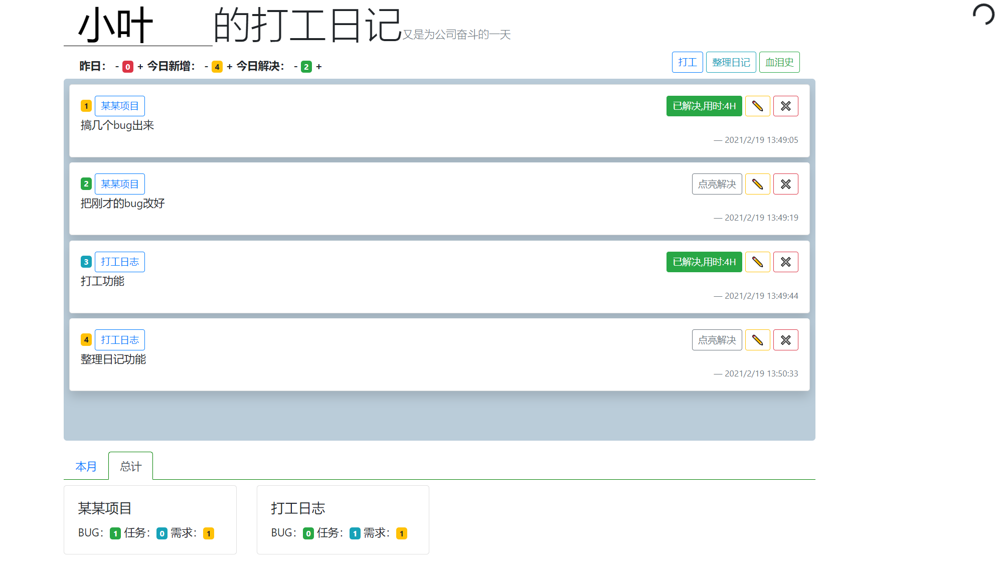
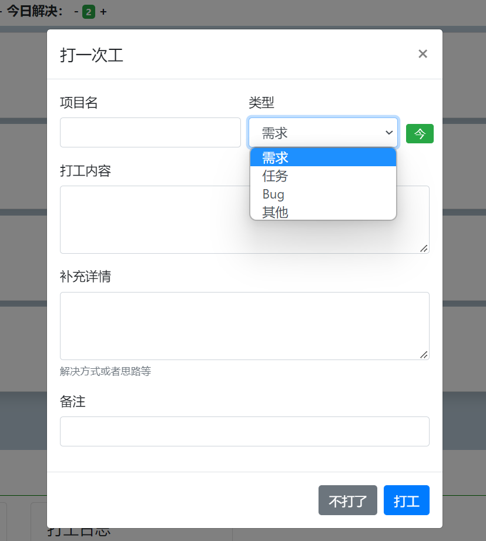
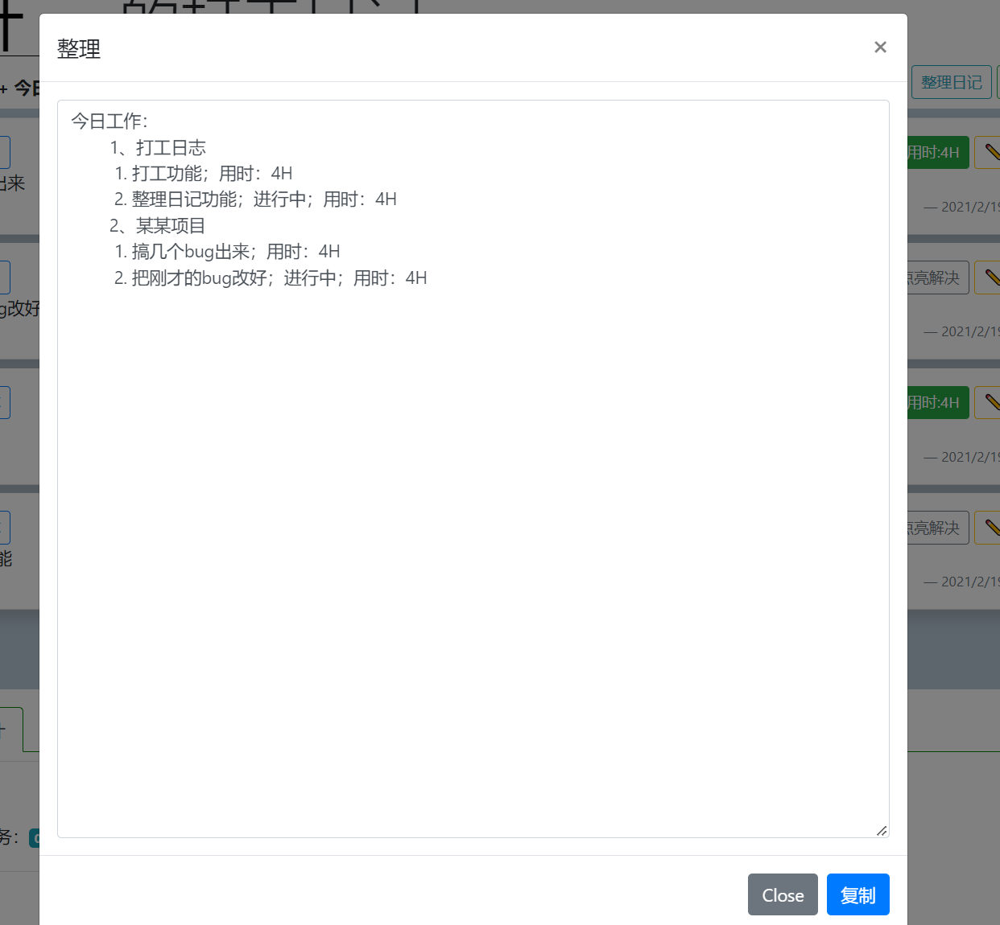
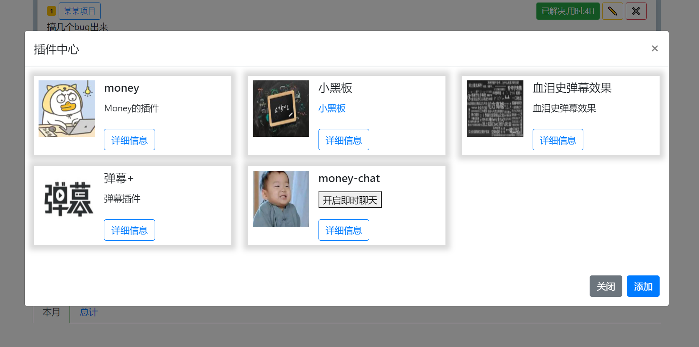
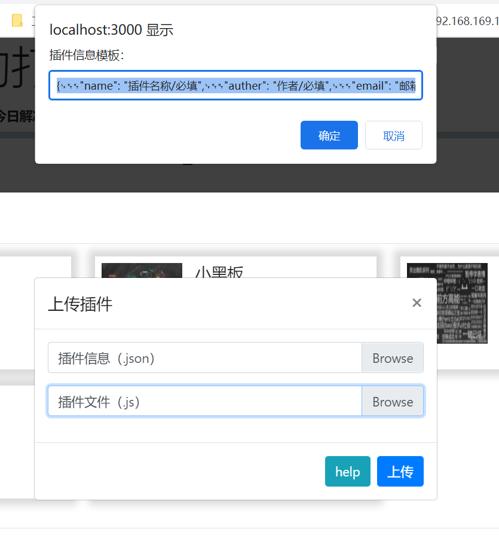

## 打工日记

因为打工需要写日报，所以就有了打工日记，来记录打工人的每一天😭。前往[体验](http://175.178.102.32/work-diary/)。

*注：所有打工记录都以 JSON 格式保存在客户端浏览器的 Local Storage 中，可放心使用。*

### 网站功能总览

网站功能主要分为两部分：**打工日记** 和 **插件中心**。

### 打工日记

#### 正常使用流程

1. **上班打工登记**：记录今天要完成的任务。
2. **完成任务**：完成后标记为解决。
3. **下班整理日记**：整理完成后可以复制结果提交日报。

#### 主界面

仅显示今天和之前未解决的记录。



#### 打工

新增打工记录，新增后可在主界面进行修改。



#### 整理

本地部署可到 `public/js/index.js` 下修改整理方法改变模板（代码都有注释）。



### 插件中心

另一个功能是插件功能，作为一种扩展。（位于体验网站的插件是共享的）

#### 插件列表

 

#### 添加插件

需上传材料：

- 插件文件（.js）
- 插件描述文件（.json）

点击 help 获取模板。



### 插件🌰

血泪史弹幕就是一个外部插件，通过给界面按钮血泪史额外绑定点击事件实现点击后弹幕显示打工统计。

  

### 本地部署

需要安装 Node.js。

1. **克隆工程**：

```bash
git clone https://github.com/ycf1998/work-diary.git
```

2. **安装依赖**：

```bash
npm install
```

3. **执行**：

```bash
node src/work-diary-app.js
```

4. **访问**：[http://localhost:3000](http://localhost:3000)

不用一直开着，数据都存在浏览器 Local Storage 上，进来就会加载。
